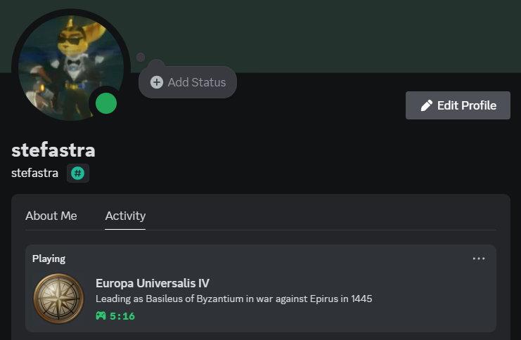

## Unofficial Europa Universalis IV Discord Rich Presence Integration

> This modification tries to read the latest autosave and shows the information on Discord.
> However, it's still in development. Be patient.

### What it does
- Shows what country you are playing, and it's government rank
- Shows the the month and year of the latest autosave

### What it doesn't do
- Turn off the "compress autosaves" option when saving. You need to do that by yourself
- Build you galleys

### Setup

- Use the provided installer. [Coming soon]
- ~~Subscribe to the mod on the Steam workshop.~~

### Test Build
While not the most elegant interface, it should work if you want to try out this program before it's complete.

### How it works
Right now it simply reads the latest save file available. This may create a couple of issues as it can only read uncompressed autosaves, so it is important that you have autosave compression turned off in the game's settings. 
