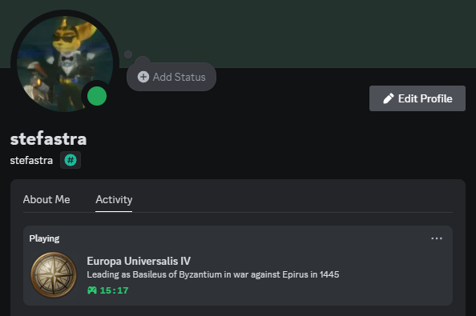

## Unofficial Europa Universalis IV Discord Rich Presence Integration

> This modification uses the Steam rich presence as a base and shows the information on Discord.
> However, it's still in development. Be patient.

### Setup

- Use the provided installer. [Coming soon]
- ~~Subscribe to the mod on the Steam workshop.~~
